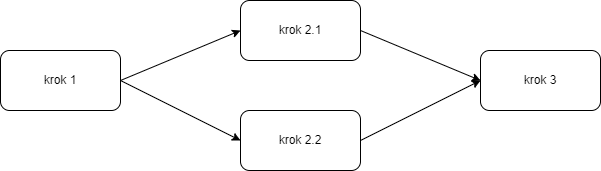

## Spis treści

- [Instalacja](#instalacja)
- [Skąd brać publikacje](#skąd-brać-publikacje)
- [Formatowanie pracy](#formatowanie-pracy)
  - [Tabele](#tabele)
  - [Rysunki](#rysunki)
  - [Równania](#równania)
  - [Źródła](#źródła)
  - [Twarda spacja](#twarda-spacja)
  - [Dzielenie wyrazów](#dzielenie-wyrazów)
- [Styl pracy](#styl-pracy)
  - [Forma bezosobowa](#forma-bezosobowa)
  - [Autor rozdziału/podrozdziału](#autor-rozdziału-podrozdziału)
  - [Terminy i definicje](#terminy-i-definicje)
  - [Wykresy](#wykresy)
  - [Schematy](#schematy)

## Instalacja

```
sudo apt install texlive-full
```

Używamy xelatex (ew. lualatex), bo pdflatex i latex nie potrafią skompilować fontu Arial.

## Skąd brać publikacje

- https://typeset.io/
- https://scholar.google.com/
- https://pg.edu.pl/biblioteka-pg/e-zasoby/bazy-danych

## Formatowanie pracy

### Tabele

Każda tabela musi być przywołana w tekście pracy za pomocą ~\ref (ref wstawia tylko numer, więc przed trzeba napisać słowo "Tabela").

```tex
Prosty przykład jest pokazany w Tabeli ~\ref{tab:tab1}.

\begin{table}[h]
\caption{Opis tabelki}
\label{tab:tab1}
 \centering
\begin{tabular}{|c|p{4.5cm}|p{6cm}|}
  \hline
  Pole 1 & Pole 2 & Pole 3\\
  \hline
  1 & Pojęcie & Opis tegoż pojęcia\\
  \hline
  2 & Pojęcie & Opis tegoż pojęcia\\
  \hline
\end{tabular}
\end{table}
```

### Rysunki

Każdy rysunek musi być przywołany w tekście pracy za pomocą ~\ref (ref wstawia tylko numer, więc przed trzeba napisać słowo "Rysunek").

```tex
Prosty przykład prezentuje Rysunek ~\ref{fig:swiat}.

\begin{figure}[htbp]
    \centering
    \includegraphics[width=0.9\textwidth]{images/swiat.png}
    \caption{Opis rysunku}
    \label{fig:swiat}
\end{figure}
```

### Równania

Również trzeba dać odwołanie do równania.

```tex
przykład przedstawia Równanie ~\ref{eq:przyklad1}.

\begin{equation}
  \mathcal{O(K,B,C,R)}
  \label{eq:przyklad1}
\end{equation}
```

### Źródła

W tekście umieszczamy odnośnik do źródła/źródeł.

```tex
~\cite{publikacja1,publikacja2}
Algorytm euklidesa~\cite{publikacja3} służy do...
```

W bibliography.bib umieszczamy definicję źródła. Jeśli dostęp był internetowy, należy podać datę dostępu. Sprawdzajcie, czy nie ma gotowych cytowań do skopiowania, np. na arxiv.org jest po prawej "Export BibTeX citation".

```tex
@misc{park2023generativeagentsinteractivesimulacra,
    title         = {Generative Agents: Interactive Simulacra of Human Behavior},
    author        = {Joon Sung Park and Joseph C. O'Brien and Carrie J. Cai and Meredith Ringel Morris and Percy Liang and Michael S. Bernstein},
    year          = {2023},
    eprint        = {2304.03442},
    archiveprefix = {arXiv},
    primaryclass  = {cs.HC},
    url           = {https://arxiv.org/abs/2304.03442}
}

@article{publikacja1,
    author   =  {{Tom Alphin}},
    title    =  "2019 Most Common LEGO Parts \url{https://brickarchitect.com/2019/2019-most-common-lego-parts/}",
    urldate  =  "2021-05-06",
}

@book{boinski2007kaskbook,
    title={{Architektura portalu dziedzinowego}},
    author={Boiński, T.},
    journal={Praca zbiorowa Katedry Architektury Systemów Komputerowych KASKBOOK},
    year={2008},
    publisher={Katedra Architektury Systemów Komputerowych, Wydział ETI Politechnika Gdańskiej},
    pages={81--92}
}
```

### Twarda spacja

Aby uniknąć tzw. sierot (pojedynczych znaków na końcu wiersza), używamy twardej spacji, czyli zamiast zwykłej spacji wstawaimy tyldę. Dzięki temu słowa będą "sklejone" (linia nie zostanie złamana pomiędzy tymi słowami). Używamy przed wszytskimi krókimi wyrazami, np. w, z, na, o, do, poza, za itp.
```tex
dokument, w~którym
```

### Dzielenie wyrazów

Jeśli chcemy wymusić dzielenie wyrazu na końcu linii w konkretnym miejsu, używamy \\- w miejscu podziału. Latex takiego ukośnika nie wydrukuje dopóty, dopóki rzeczywiście w tym miejscu nie zostanie wykonane przeniesienie części wyrazu. Możliwe jest dodanie wielu podziałów w jednym wyrazie. Użyte wtedy zostanie to, które spowoduje wygenerowania „najładniejszego” tekstu.
```tex
chcemy wymusić prze\-nie\-sie\-nie w jednym z tych miejsc
```

## Styl pracy

### Forma bezosobowa

- Piszemy np. "wykonano" albo "został wykonany", a nie "wykonaliśmy".

### Autor rozdziału/podrozdziału

- Pod każdym tytułem rozdziału/podrozdziału piszemy imię autora _kursywą_.

### Terminy i definicje

- Wszystkie pojęcia powinny być jak najbardziej spolszczone. Piszemy nazwę polską, a jeśli chcemy podać nazwę angielską, podajemy ją w nawiasie.
  - Przykład: agenci generatywni (ang. _generative agents_)
  ```tex
  agenci generatywni (ang. \textit{generative agents})
  ```
- W pracy dyplomowej należy podawać definicję terminu, przy pierwszym jego użyciu. Nie należy stosować skrótów nazw metod albo firm itp., bez wcześniejszego rozwinięcia ich znaczenia.
  - Przykład: AOP (Aspect-Orineted-Programming) to...

### Wykresy

- Umieszczamy w pracy jako rysunki.
- matplotlib

### Schematy

- Umieszczamy w pracy jako rysunki.
- draw.io
  - zaokrąglone prostokąty
  - główny kolor: biały
  - na białym tle


